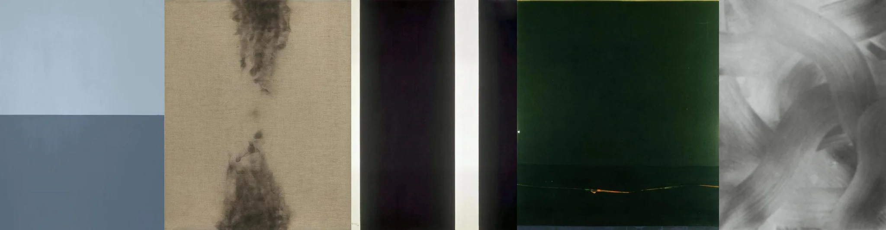

# Sample Debug Log

- turn: 19
- timestamp: 2026-02-24T23:02:05

## LLM Description

Double exposure artwork samples show: minimal blue-gray gradient abstraction, vertical canvas with wispy smoke-like forms, film edge artifact with dark strip and white borders, dark green frame with scratch damage, and soft grayscale cloud-like abstraction. These overlap with minimal abstract art more than pure double exposure technique. Will commit with adjusted threshold.
