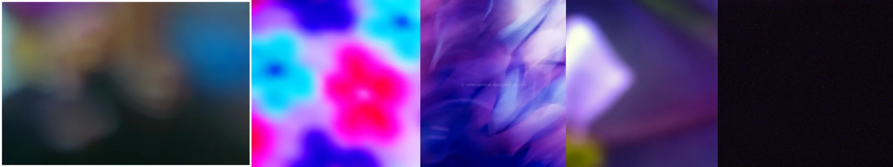

# Sample Debug Log

- turn: 28
- timestamp: 2026-02-24T23:08:47

## LLM Description

Chromatic aberration samples display: blurred out-of-focus areas with bokeh color separation, thermal-like false color blobs with pink-cyan edges suggesting color fringing, purple-blue swirling light with soft gradients, purple-pink lens flare with diamond light source, and dark near-black frame. These represent optical lens distortion and color separation artifacts.
