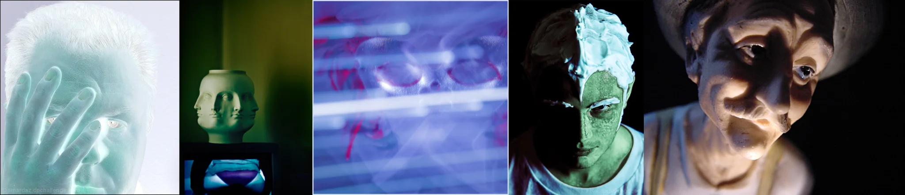

# Sample Debug Log

- turn: 5
- timestamp: 2026-02-24T21:01:43

## LLM Description

采样的5张图片：1) 青白色调的虚掩遮脸人像，手指缝隙中可见发光的眼睛，幽灵般半透明的质感；2) 绿光照射下的三面陶瓷人面雕塑，三面朝向不同方向；3) 蓝紫色调画面带水平扫描线干扰，模糊圆形面部轮廓带红色涂鸦痕迹；4) 半头部被白色泡沫覆盖的人物，绿色粗糙皮肤，戏剧化暗光；5) 近距离仰视的人脸，比例扭曲，眼窝深陷，底部硬光产生强烈阴影。全体呈现"近乎人类却非人"的恐怖谷特质。
