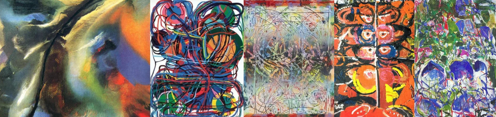

# Sample Debug Log

- turn: 18
- timestamp: 2026-02-24T21:15:48

## LLM Description

采样的5张迷幻艺术图片：1) 橙黄蓝渐变抽象人体，修长扭曲的肢体，表现主义风格；2) 彩色线条在白色背景上的复杂缠绕涂鸦状构图，蓝红绿主色调；3) 多层网格线与有机形态叠加的混合媒介，细密混乱的线稿；4) 橙色背景中重复的眼形图案，蓝粉黄强烈对比，黄色蝴蝶形象，原始图腾感；5) 紫绿蓝色泼洒的抽象表现主义，厚重的颜料堆叠，混乱笔触。全体呈现高饱和度色彩与扭曲形态的迷幻特征。
