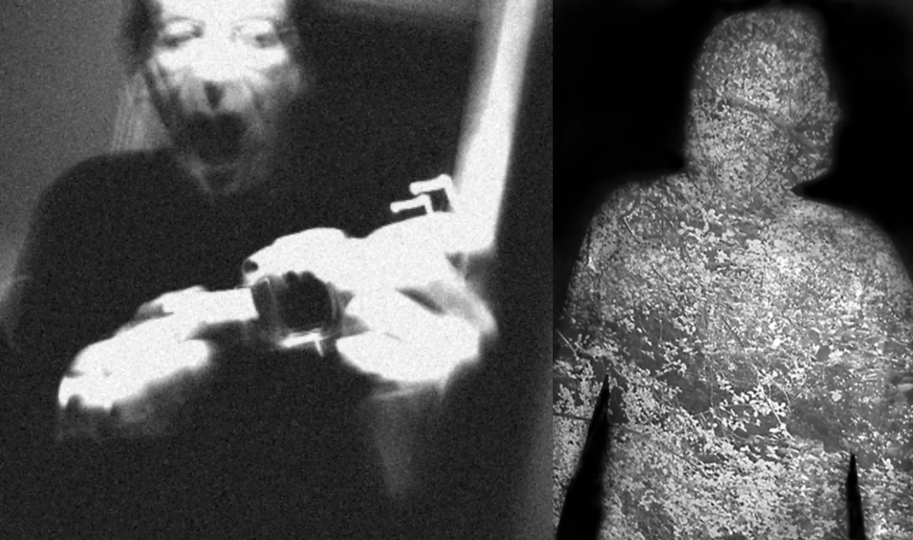

# Sample Debug Log

- turn: 20
- timestamp: 2026-02-24T21:17:43

## LLM Description

采样的2张模拟恐怖图片：1) 高噪点黑白画面中人物持握手枪状物体，夸张的面部尖叫表情，明显的VHS扫描线失真与过曝；2) 通过孔洞视角拍摄的静态噪点填充的人形轮廓剪影，颗粒感覆盖全身。典型模拟恐怖特征：低保真度、降级画质、监控/纪录片质感，暗示性威胁与不安氛围。
