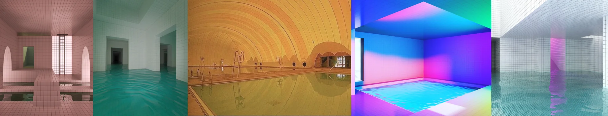

# Sample Debug Log

- turn: 25
- timestamp: 2026-02-24T21:24:11

## LLM Description

采样的5张梦核图片：1) 粉红色瓷砖房间，水面覆盖地板，拱形门洞透出绿光，梦幻怀旧氛围；2) 青绿色调漫水走廊，墙壁向黑暗深处延伸，水面反射柔和光线；3) 金黄色调的拱形泳池大厅，金属扶梯，重复拱顶结构；4) 霓虹渐变渲染的泳池房间，粉蓝紫色彩夸张配色，明显的CG质感；5) 白色小瓷砖空间，顶部柔和的粉紫光照明，几何结构向深处延伸。典型的阈限空间特质：空荡、瓷砖、水面、怀旧却不安的氛围。
