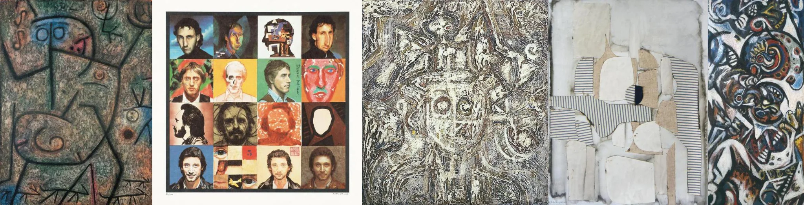

# Sample Debug Log

- turn: 27
- timestamp: 2026-02-24T21:24:49

## LLM Description

采样的5张weirdcore图片：1) 左：几何象形人物原始绘画，绿灰色背景上蓝粉色人形带螺旋眼睛，稚拙线条；2) 网格拼贴：16格不一样的扭曲面部，包括骷髅、分割脸、褪色空洞脸，明亮彩色背景；3) 中：黑白刮版画，漩涡有机纹理中浮现多个眼睛细节，混乱层次；4) 撕纸拼贴：撕碎 beige 纸与条纹布料重组，几何抽象阶层；5) 右：表现主义油画，蓝黑白肤色调漩涡，扭曲面孔、凸眼、尖叫嘴。典型weirdcore特征：碎片化身份、错位象征、人脸错位、拼贴解构。
