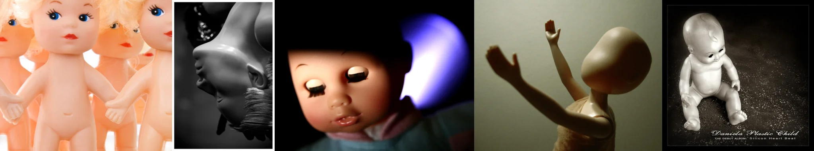

# Sample Debug Log

- turn: 32
- timestamp: 2026-02-24T21:26:45

## LLM Description

采样的5张玩具/人偶图片：1) 并排站立的多个金发蓝眼塑料娃娃，空洞可爱的表情，粉色合成皮肤；2) 黑白摄影中光滑的人偶面部倒悬，塑料反光质感，头发纹理细节；3) 亚洲风格娃娃面部特写，不自然的下巴缝合痕迹，背后蓝色光晕；4) 简约的人偶形体，光滑色肤，双手向上伸展，姿态呆板；5) 银色闪光粉末背景上的灰白塑料婴儿坐姿，褶皱关节，专辑封面质感。典型塑料玩具美学：统一光泽、简化细节、生命力缺失的情感扁平。
