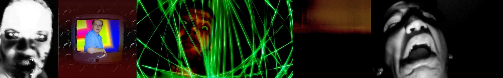

# Sample Debug Log

- turn: 34
- timestamp: 2026-02-24T21:27:31

## LLM Description

采样的5张模拟恐怖图片：1) 过曝的扭曲面孔，眼睛睁大嘴巴张开，幽灵般苍白皮肤，故障效果；2) 老式CRT电视屏幕显示蓝衬衫男子与色彩扭曲渐变，暗背景带纹理；3) 恐怖小丑/狗脸从绿色激光网格后窥视，红色皮肤，凝视镜头；4) 橙暗渐变色的模糊远景，失焦地平线（可能是胶片烧毁或模拟降级）；5) 仰角黑白扭曲尖叫面孔，夸张张嘴，恐怖表情。典型模拟恐怖特质：降级画质、CRT屏幕、扭曲人脸、低保真档案美学。
