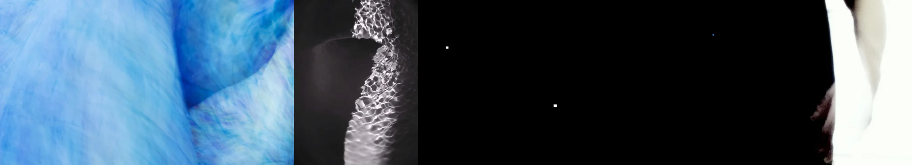

# Sample Debug Log

- turn: 5
- timestamp: 2026-02-25T16:18:19

## LLM Description

Sampled photorealism images show: flowing blue fabric with soft organic curves and folds, intricate glass condensation/lace patterns in monochrome, and high-contrast abstract forms. The close-up textures demonstrate realistic material rendering with convincing lighting. The purely dark image may be a low-quality sample needing exclusion via negative prompts.
