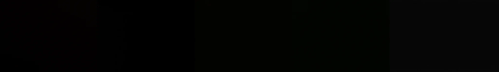

# Sample Debug Log

- turn: 12
- timestamp: 2026-02-25T16:20:54

## LLM Description

Sampled cinematic images from photos dataset at threshold 0.43-0.49 are almost entirely black/dark with minimal visible content. These appear to be underexposed or intentionally dark frames that don't provide useful visual information. Need to use negative prompts to exclude overly dark/blank images and sample at a slightly lower threshold range.
