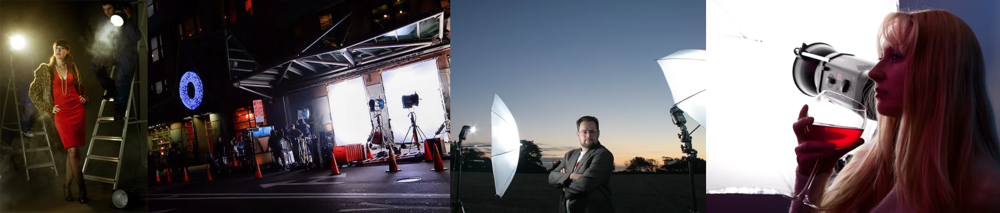

# Sample Debug Log

- turn: 14
- timestamp: 2026-02-25T16:21:31

## LLM Description

Sampled cinematic images at 0.35-0.42 threshold show professional photography and film production scenes: fashion shoot with dramatic spotlighting, film set with lighting equipment and crew, portrait with studio umbrella lights against sunset backdrop, and stylized portrait with wine glass. These demonstrate high-quality cinematic lighting and composition typical of film production.
