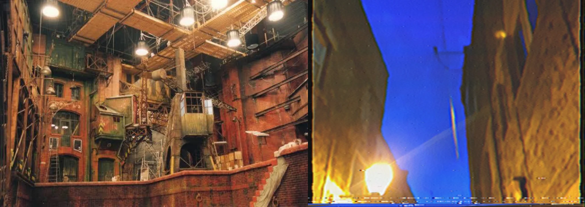

# Sample Debug Log

- turn: 17
- timestamp: 2026-02-25T16:22:30

## LLM Description

Dreamcore cinematic samples show elaborate constructed film sets: an industrial interior complex with dramatic overhead lighting, rust-colored architecture with scaffolding; and a surreal canyon landscape with towering cliffs against blue sky, warm lighting from below and silhouetted figures creating epic scale. Both demonstrate cinematic composition with controlled dramatic lighting typical of production design.
