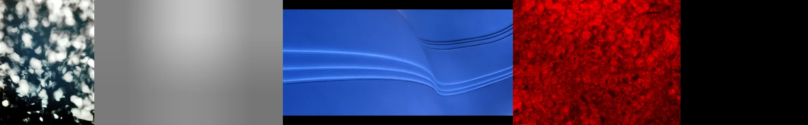

# Sample Debug Log

- turn: 23
- timestamp: 2026-02-25T16:24:21

## LLM Description

Hyperrealism photo samples show extreme textural detail: dappled sunlight through foliage creating organic bokeh, smooth gradient surfaces, blue fluid with ripple curves showing precise refraction, and vivid red crystalline/bubbled surface with microscopic texture clarity exceeding normal vision.
