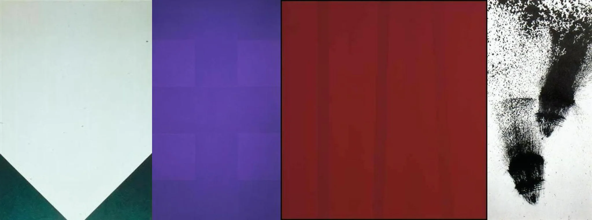

# Sample Debug Log

- turn: 53
- timestamp: 2026-02-25T18:58:36

## LLM Description

Stylized consistency artwork samples show: hard-edge geometric painting with precise triangular forms in white and dark green, uniform purple color field with subtle grid structure, solid burgundy/red color field with consistent tone, and high-contrast black ink splatter with systematic texture pattern. The first shows distinct stylized geometry while others are more minimalist color field.
