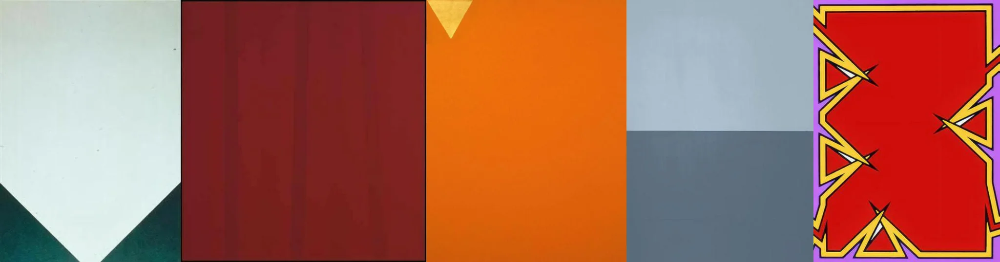

# Sample Debug Log

- turn: 58
- timestamp: 2026-02-25T19:00:12

## LLM Description

Stylized consistency samples show: clean geometric compositions with hard-edge painting technique, unified color fields (white/dark green, burgundy, orange, gray tones), minimal elements with precise placement, and bold graphic patterns with red, yellow and purple creating vibrant coherent visual language.
