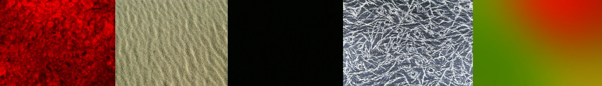

# Sample Debug Log

- turn: 65
- timestamp: 2026-02-25T19:02:43

## LLM Description

Natural surface samples show: vivid red crystalline/bubbled material texture with extreme detail, sand ripples with natural wind patterns showing realistic surface topology, intricate white fibrous/frost texture on dark background, plus one black frame and one gradient abstract. The material studies demonstrate believable microstructure and varied surface responses.
