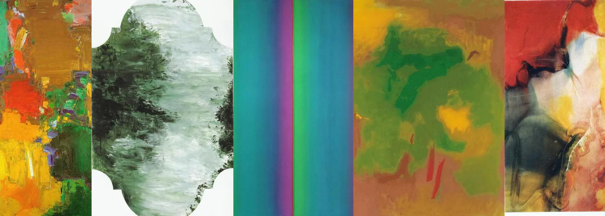

# Sample Debug Log

- turn: 68
- timestamp: 2026-02-25T19:03:36

## LLM Description

Painterly samples show: vibrant impasto abstract piece with thick paint in warm palette (yellow, orange, green, red), grayscale landscape with textured gestural brushwork in decorative format, smooth color field gradients (teal-magenta-green), atmospheric color field in green-yellow tones, and abstract expressionist work with bold red and gestural marks. Demonstrates refined painting techniques and intentional color composition.
