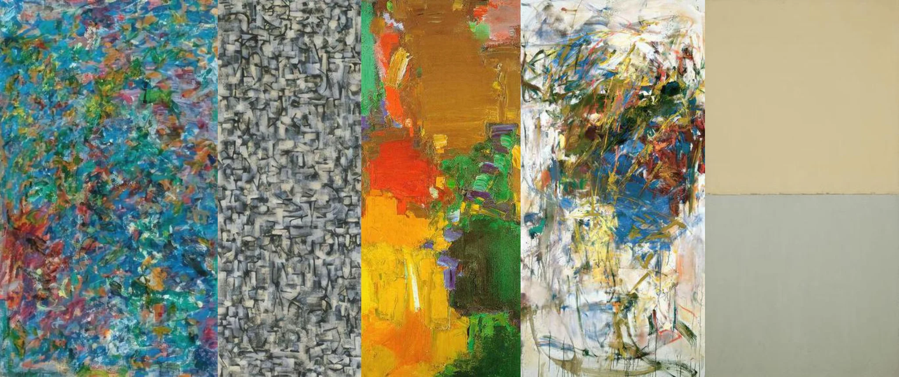

# Sample Debug Log

- turn: 75
- timestamp: 2026-02-25T19:07:22

## LLM Description

Fine art samples show museum-quality paintings: heavy impasto textured work in blues and colors, systematic black and white geometric patterning, bold color field blocks in warm tones, gestural abstract expressionism with drips and splatters, and minimalist two-tone painting. Demonstrates exceptional skill across different painting traditions and techniques.
