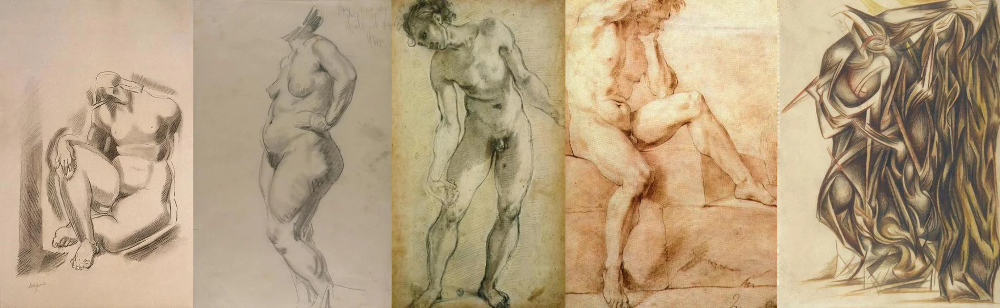

# Sample Debug Log

- turn: 7
- timestamp: 2026-02-25T20:43:57

## LLM Description

Sampled anatomical artwork: 5 classical figure studies showing accurate human anatomy - seated nude with detailed musculature, full standing figure with proper body proportions, muscular male figure in contrapposto, draped fabric study showing underlying form. All demonstrate professional anatomical correctness. Next step: rate aesthetics and commit this batch.
