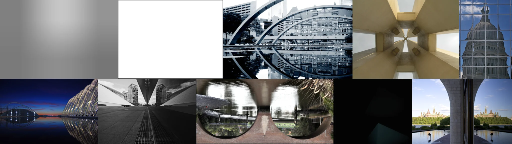

# Sample Debug Log

- turn: 13
- timestamp: 2026-02-25T20:45:47

## LLM Description

Sampled 10 symmetry photos showing: gradient backgrounds, architectural collages with circular framing, modern building with geometric interior symmetry, glass dome reflection, mirrored city skyline at night, abstract corridor with strong vanishing point, water reflections in pool, arched windows with palace view. Mix includes both pure gradients/abstracts and concrete symmetrical architecture. Need to check distribution and commit higher quality architectural examples.
