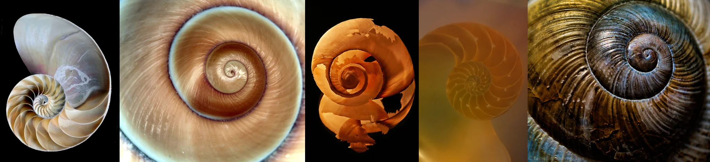

# Sample Debug Log

- turn: 19
- timestamp: 2026-02-25T20:48:03

## LLM Description

Sampled golden ratio photos: 5 stunning nautilus shell cross-sections showing perfect Fibonacci spiral patterns in nature. Images display mother-of-pearl interiors, detailed spiral chambers, and mathematical precision in organic form. High quality macro photography demonstrating divine proportion in nature. Next: rate aesthetics and commit this strong batch.
