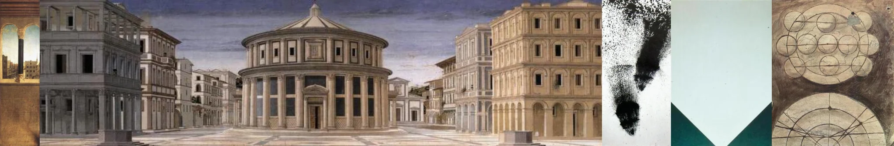

# Sample Debug Log

- turn: 25
- timestamp: 2026-02-25T20:51:44

## LLM Description

Sampled Renaissance perspective artwork: 5 classical architectural drawings showing perfect linear perspective with vanishing points, including what appears to be Renaissance city squares, classical buildings with receding planes, and geometric perspective construction drawings. These demonstrate the discovery of mathematical perspective in Western art, with accurate spatial depth and proportion.
