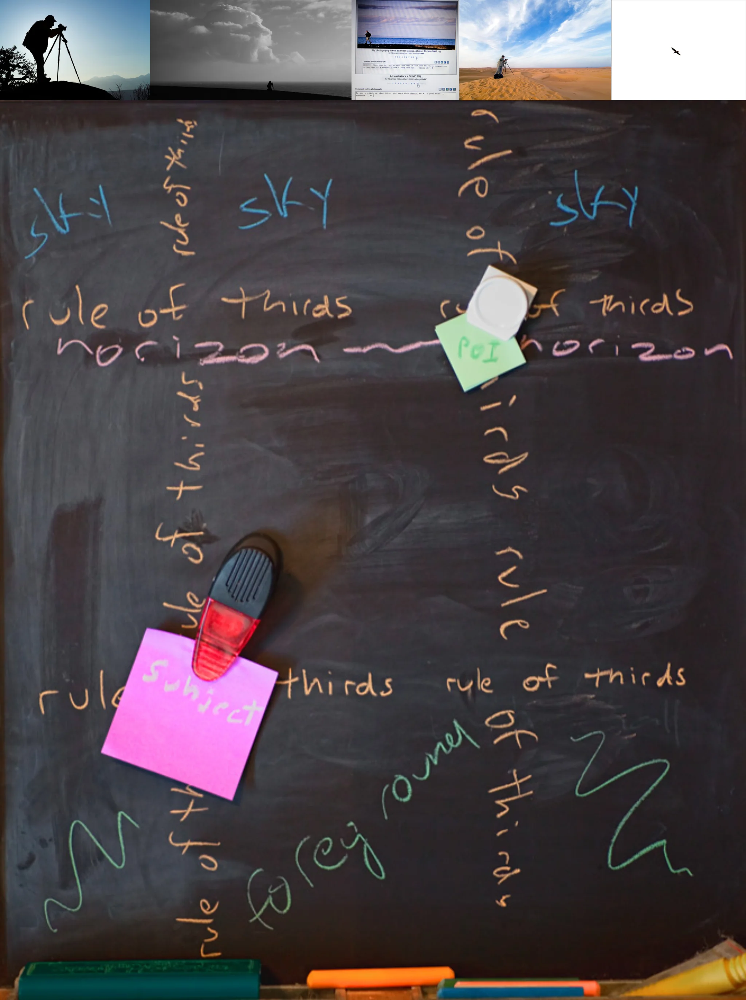

# Sample Debug Log

- turn: 27
- timestamp: 2026-02-25T20:52:27

## LLM Description

Sampling issue: Even at 0.4-0.45 threshold, got educational blackboard with 'rule of thirds' written on it rather than actual landscape photographs demonstrating the technique. Need to refine query to avoid instructional content. Will try different search terms like 'landscape photography sunset beach composition' to find actual photos using rule of thirds.
