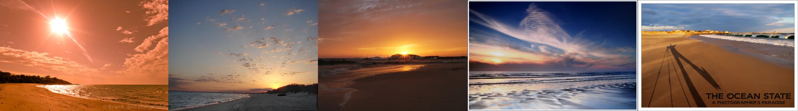

# Sample Debug Log

- turn: 33
- timestamp: 2026-02-25T20:54:29

## LLM Description

Sampled beach landscapes: 5 professional photographs showing beach scenes with dramatic sunsets/sunrises, sky occupying 2/3 of frame and sand/water in bottom 1/3 - classic rule of thirds composition. Images display long shadows, reflective wet sand, colorful sky transitions, and photographers working on location. Strong examples of compositional balance in landscape photography.
