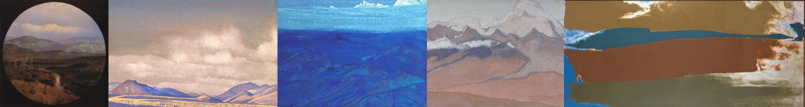

# Sample Debug Log

- turn: 43
- timestamp: 2026-02-25T20:58:39

## LLM Description

Sampled aerial perspective artwork: 5 landscape paintings demonstrating atmospheric perspective - tondo format circular landscape, muted desert mountains with clouds, layered blue mountain ranges, pink/gray misty peaks, abstracted landscape with horizontal bands. All show depth through color temperature shifts and value changes, distant elements cooler and less contrasty.
