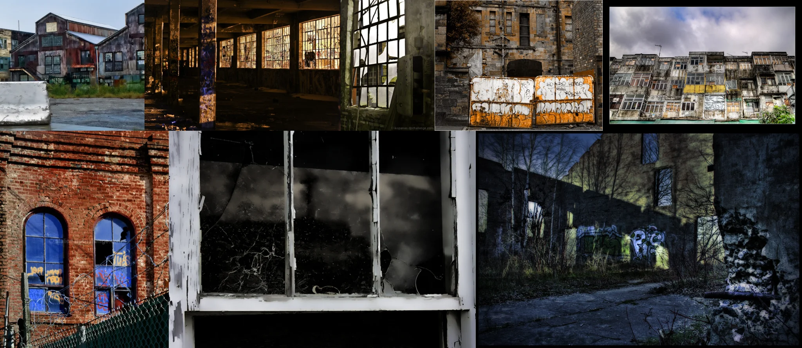

# Sample Debug Log

- turn: 25
- timestamp: 2026-02-16T18:43:12

## LLM Description

Photos采样显示：废弃建筑的石梳全色调：后院废弃工厂群，破碎玻璃大窗的内部景观和结构钢筋，封闭城市建筑上的佛德式涂鸦，8破屏风格的升级屋顶；红砖拱形窗户被钢桩包围，破损的白艺术窗户，以及黑夜萨影和涂鸦的南部产术风景，得展现废弃儒的多重表现形式。
