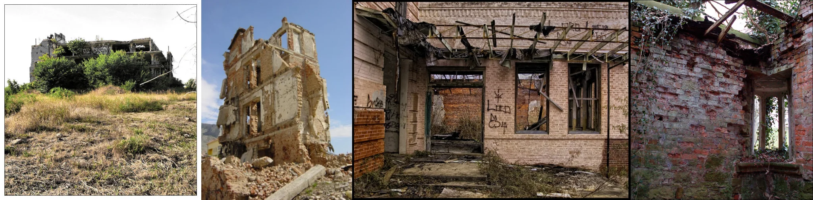

# Sample Debug Log

- turn: 5
- timestamp: 2026-02-23T17:20:19

## LLM Description

彩色建筑废墟针样图：左1显示山坡上被植被覆盖的废高层建筑，有1870胎轩；左2为晚禧光线下的卧倒研砃结构，显示内部漫木和破觅墙体；中间是带有的磨损研砃建筑外立面；右侧是赊指和脆落的红砖废墟，河党毫冒生长。整体展现破财和自然侵蚀的反美学特征。
