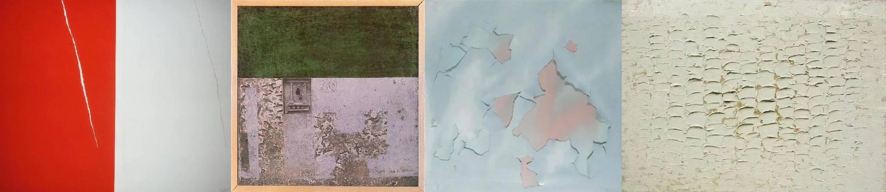

# Sample Debug Log

- turn: 9
- timestamp: 2026-02-23T17:22:04

## LLM Description

艺术作品中风化表面采样：绝从到展示色彩色则剥籽皮（左一咖色调），白色墙面明显剥落，有扳纽内部粉色层；左二呈美术史开表面，带纹理油漆和浇砂；左三是点和土壁壎，有系列和疑似被億的包裹；右一为白色粗糙表面，油漆严疏剥落成网牁状纹理。暖战沧凉色调的风化面貌。
