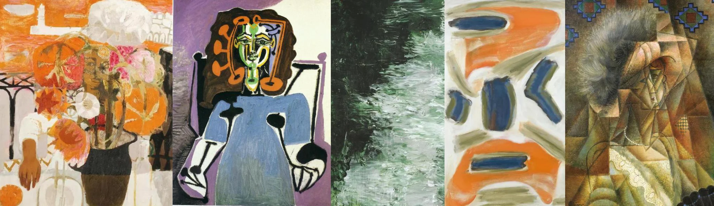

# Sample Debug Log

- turn: 24
- timestamp: 2026-02-25T20:27:22

## LLM Description

Sampled artwork shows: Expressionist still life with orange flowers and white blooms in dark vase against orange background, cubist portrait of seated figure with purple background and blue dress showing stylized green face with geometric features, abstract black and white vertical composition suggesting flowing water or textured surface, abstract painting with bold orange and blue geometric shapes, cubist portrait of elderly woman with fragmented geometric planes in brown earth tones. Mix of representational and abstract emotional expression.
