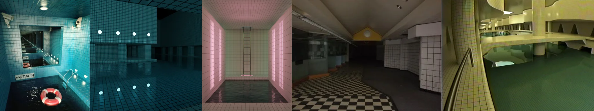

# Sample Debug Log

- turn: 32
- timestamp: 2026-02-25T20:32:09

## LLM Description

Sampled dreamcore liminal spaces show: Teal-tiled indoor pool room with water reflections, life preserver, and '∞FT ∞IN' signage suggesting game asset, pink-lit corridor with vertical light panels and water at end, checkered floor hallway with sloped ceiling and tiled walls creating unsettling perspective, yellow-green multi-level pool facility with curved architecture and submerged areas. Strong liminal atmosphere with colored lighting typical of dreamcore aesthetic.
