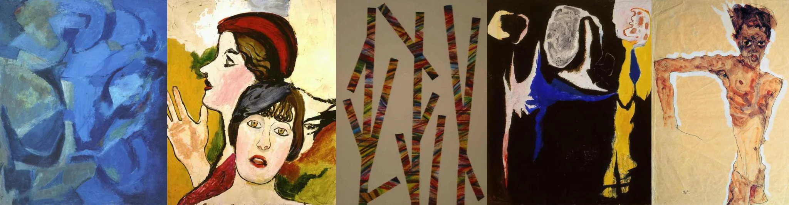

# Sample Debug Log

- turn: 42
- timestamp: 2026-02-25T20:37:02

## LLM Description

Sampled expressive gesture artwork shows: Abstract blue composition with overlapping organic shapes suggesting hand forms, expressionist portrait with two overlapping figures and raised hand gesture, geometric abstract pattern with multicolored stripes forming angular shapes, black background with bold white and blue gestural shapes suggesting movement, raw expressionist figure painting with extended thin limbs and contorted body conveying emotional intensity.
