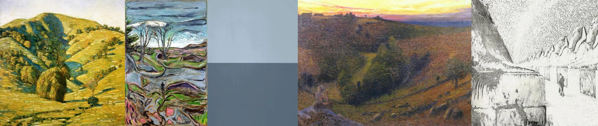

# Sample Debug Log

- turn: 48
- timestamp: 2026-02-25T20:40:00

## LLM Description

Sampled solitary figure landscape artworks show: Rolling pastoral hills with warm yellow-green tones and single stone structure in foreground, expressionist landscape with twisted bare trees and organic swirling forms in muted blues and greens, hills at sunset with ochre and purple tones showing small seated figure on hillside, black and white stippled drawing of canyon landscape with tiny human figure on cliff edge emphasizing scale and isolation.
