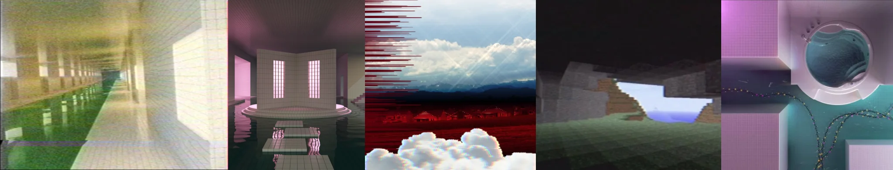

# Sample Debug Log

- turn: 6
- timestamp: 2026-02-24T21:32:06

## LLM Description

采样图片内容描述：1) 长走廊配绿色水面倒影和柔和光照 2) 室内水池配粉色窗户透光和中央平台结构 3) 带故障艺术条纹的红色风景与云层 4) 低多边形风格的几何景观与建筑体块 5) 粉紫色调室内空间配圆形舷窗式结构和链条装饰。整体呈现柔和光照、低对比度、轻微模糊的dreamcore特征。
