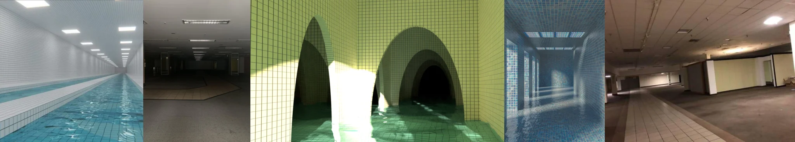

# Sample Debug Log

- turn: 12
- timestamp: 2026-02-24T21:33:25

## LLM Description

采样图片内容描述：1) 白色瓷砖长走廊配蓝色水面和重复荧光灯 2) 深色空荡地下停车场配网格状天花板灯 3) 绿色瓷砖拱形隧道配水面倒影和阴影 4) 蓝色调瓷砖水池空间配光线透射 5) 废弃商场内部配棕色地砖和空置店面。所有图片呈现强烈的线性透视和重复几何结构。
