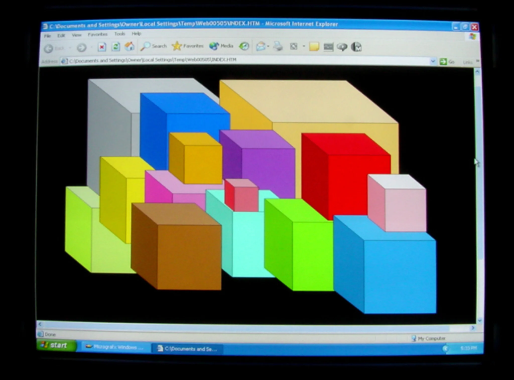

# Sample Debug Log

- turn: 55
- timestamp: 2026-02-24T21:47:09

## LLM Description

采样图片内容描述：老式Windows XP电脑屏幕显示Internet Explorer浏览器窗口，展示低多边形彩色立方体3D图形，具有典型的2000年代早期网页美学特征，包括经典的蓝色标题栏、工具栏图标和Windows开始按钮。
