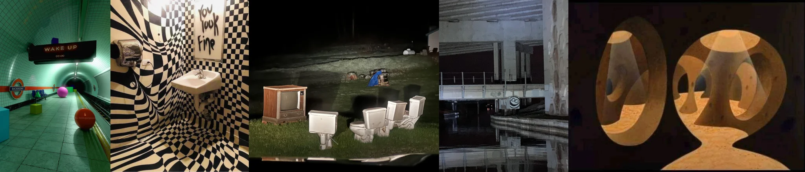

# Sample Debug Log

- turn: 63
- timestamp: 2026-02-24T21:50:29

## LLM Description

采样图片内容描述：1) 绿色瓷砖地铁站台配'WAKE UP'标志和彩色球体 2) 黑白棋盘格扭曲浴室配洗手池和文字涂鸦 3) 夜间草地上的废弃马桶和电视机超现实组合 4) 废弃建筑内部配积水倒影和涂鸦笑脸 5) 橙色抽象几何雕塑配孔洞结构。整体呈现weirdcore的不安并置和超现实特征。
