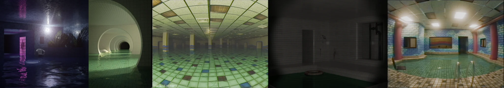

# Sample Debug Log

- turn: 81
- timestamp: 2026-02-24T21:58:38

## LLM Description

采样图片内容描述：1) 夜间户外水池配紫色反光柱子和强光照射 2) 绿色调圆形隧道水池配拱形结构和远处黑暗 3) 大型室内水池空间配网格天花板和彩色方块瓷砖地面 4) 雾气弥漫的灰色瓷砖室内空间配深色门洞 5) 复古风格室内浴池配蓝白马赛克墙和粉色柱子。整体呈现标志性的poolrooms阈限空间美学。
