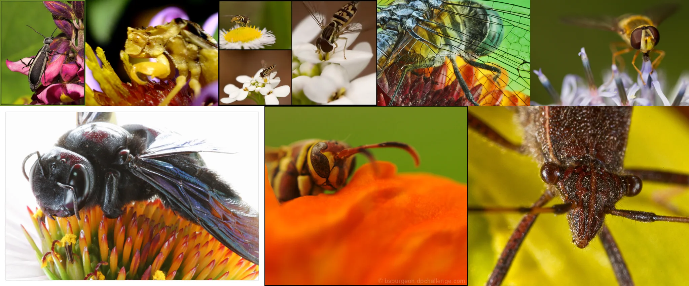

# Sample Debug Log

- turn: 11
- timestamp: 2026-02-25T20:03:40

## LLM Description

Macro photography sample shows extreme close-ups of insects on flowers: black beetle on pink blooms, carpenter bee on orange coneflower with visible wing iridescence, wasp on orange petal, dragonfly with net-like wings, hoverflies on white flowers. Sharp focus reveals compound eyes, wing veins, body hairs, and flower textures in vivid color against smooth green bokeh backgrounds.
