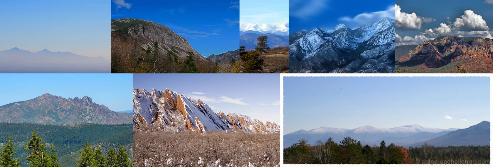

# Sample Debug Log

- turn: 13
- timestamp: 2026-02-25T20:04:12

## LLM Description

Landscape sample shows crisp mountain vistas: snow-capped peaks with textured rock faces, forested evergreen valleys, layered mountain ridges under blue skies with white clouds, reddish canyon formations, and distant hazy peaks. Images display clean atmospheric perspective with sharp foreground details including pine needles and rocky outcrops.
