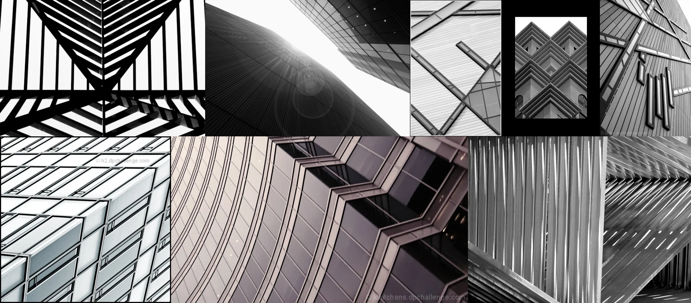

# Sample Debug Log

- turn: 15
- timestamp: 2026-02-25T20:04:48

## LLM Description

Architecture sample displays sharp geometric compositions: symmetric chevron patterns, repeating window grids, angular building facades, curved glass structures with lens flare, industrial metal patterns, and diagonal structural lines. Predominantly monochrome emphasizing crisp edges, precise angles, and the interplay of light on modern architectural surfaces.
