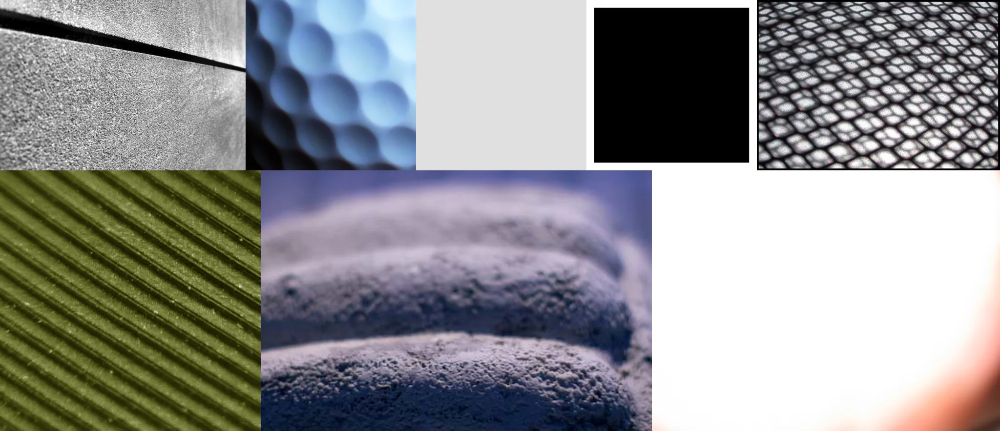

# Sample Debug Log

- turn: 17
- timestamp: 2026-02-25T20:05:31

## LLM Description

Texture sample shows material surfaces: metallic diamond-pattern mesh, green corrugated ribbed material, blue hexagonal bubble-like grid, purple stacked textured cushions, concrete panel with crack. Mix of strong material definition and some empty frames (solid black, white, gray, gradient images). Good examples of fabric and surface textures with clear weave/pattern visibility.
