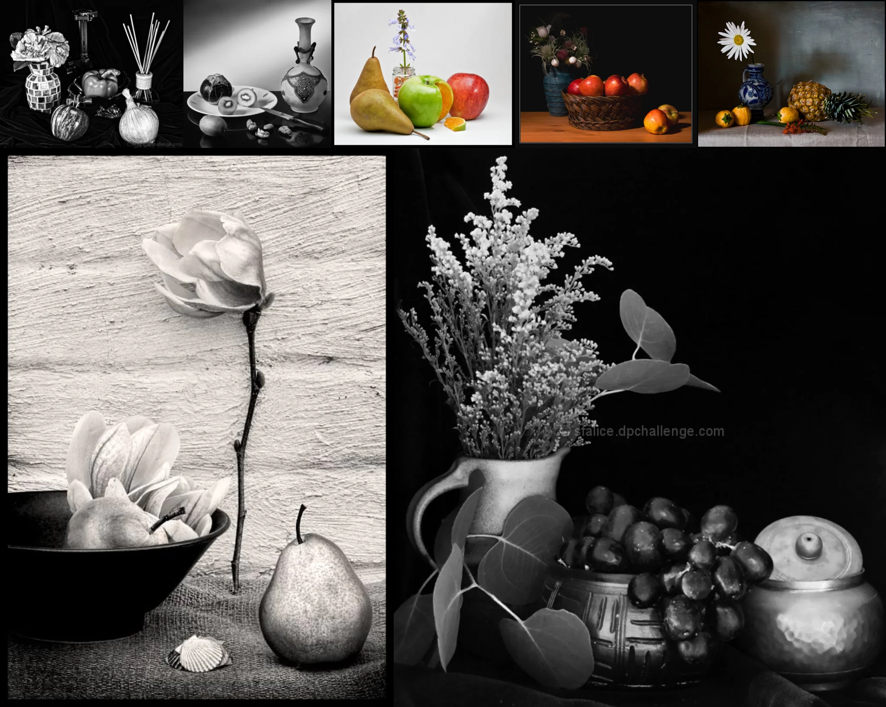

# Sample Debug Log

- turn: 33
- timestamp: 2026-02-25T20:13:44

## LLM Description

Still life sample displays classic compositions: fruit arrangements in wicker baskets (pears, apples, citrus), ceramic vases and decorative bottles, floral arrangements with daisies and baby's breath in pitchers, wooden table textures. Sharp detail visible in fruit skin, ceramic glaze surface reflections, flower petal textures. Mix of color and monochrome with strong studio lighting.
