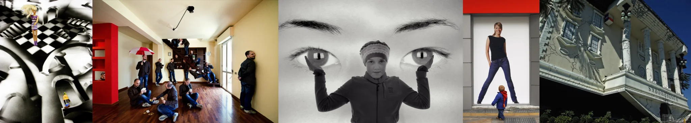

# Sample Debug Log

- turn: 15
- timestamp: 2026-02-25T14:33:12

## LLM Description

Sampled 5 images showing forced perspective tricks: (1) Alice-style surreal checkered floor with figure; (2) group of people defying gravity distribution across walls/ceiling/floor; (3) child holding giant eye props creating illusion of holding eyes; (4) giant woman poster with tiny child in foreground creating extreme scale disparity; (5) upside-down tilted building facade. All demonstrate deliberate spatial confusion and conflicting size relationships that violate normal perspective cues.
