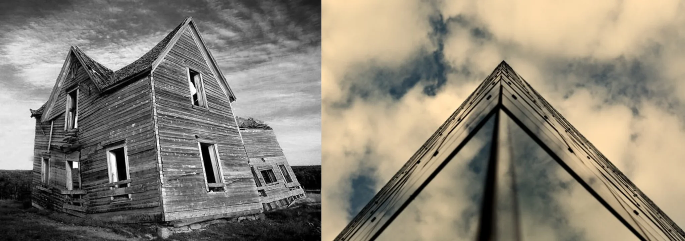

# Sample Debug Log

- turn: 20
- timestamp: 2026-02-25T14:34:41

## LLM Description

Sampled 2 images with tilted compositions: (1) leaning/distressed wooden house with off-vertical tilt creating spatial instability in grayscale; (2) worm's-eye view of modern glass building edge against sky, dramatic converging lines. Only 2 matches in range - suggests need for adjusted threshold or alternative query terms for oppositional/framing violations.
