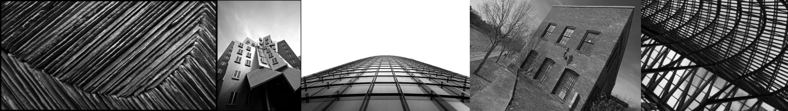

# Sample Debug Log

- turn: 22
- timestamp: 2026-02-25T14:35:40

## LLM Description

Expanded sample shows 5 dramatic angle compositions: (1) diagonal textured stripes creating converging pattern; (2) deconstructed modern building with tilting facades (Gehry-esque); (3) extreme worm's-eye view straight up glass curtain wall; (4) significantly tilted frame of old brick building creating disorienting off-level horizon; (5) upward view through geometric lattice structure. Mix of intentional dramatic perspectives and accidental tilts - good range for documenting snapshot instability aesthetic.
