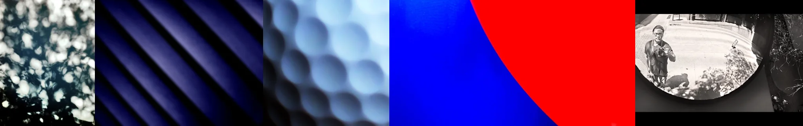

# Sample Debug Log

- turn: 29
- timestamp: 2026-02-25T14:38:22

## LLM Description

Sampled fisheye/distortion query: (1) defocused tree leaf bokeh; (2) purple-blue diagonal striped abstract; (3) hexagonal bubble/liquid texture; (4) bold red-blue color field diagonal; (5) actual fisheye lens self-portrait (relevant). Mix includes optical artifacts and accidental focus issues, but many are abstract compositions not spatial. Will commit but seek more specific spatial distortion queries.
