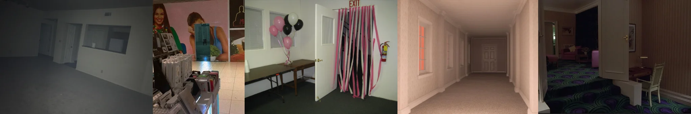

# Sample Debug Log

- turn: 38
- timestamp: 2026-02-25T14:41:51

## LLM Description

Sampled 'blocked passage' from dreamcore: (1) empty office room with obscure window/doors; (2) commercial space with magazine rack partially obscuring colorful poster; (3) office with "EXIT" door blocked by pink streamers; (4) empty pastel hallway ending in closed door (visual barrier); (5) open doorway revealing dim carpeted room. These capture deliberate spatial obstruction - key information hidden behind barriers, doors, drapery, or withheld beyond the frame edge.
