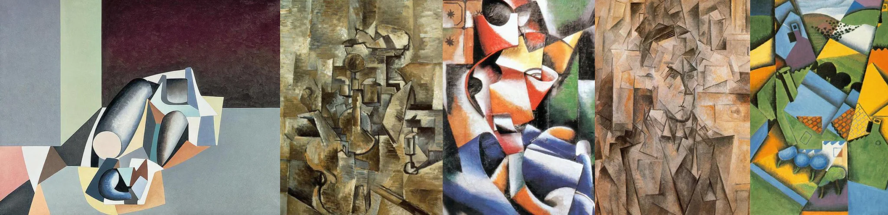

# Sample Debug Log

- turn: 45
- timestamp: 2026-02-25T14:46:24

## LLM Description

Sampled 5 cubist artworks: (1) geometric still life with bottle/glass on angled table, muted palette; (2) analytical cubism with muted browns/grays, multiple viewpoints of figures/objects fused; (3) colorful synthetic cubist portrait with bright oranges/reds/blues, checkerboard elements; (4) monochromatic brown cubist portrait, infinite facets simultaneously showing profile and frontal views; (5) vibrant synthetic cubist landscape with house and trees in geometric fragments. All exemplify deliberate destruction of naturalist single-point perspective - anti-aesthetic in traditional representation sense.
