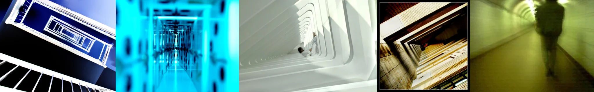

# Sample Debug Log

- turn: 47
- timestamp: 2026-02-25T14:47:19

## LLM Description

Sampled vertigo/canted angle photographs: (1) looking down blue architectural structure with stacked rectangular openings creating dizzy descent sensation; (2) cyan-tinted infinite corridor with repeating rectangular frames, disorienting perspective; (3) top-down view into curved white architectural void with tiny human figure, creating scale disorientation and falling anxiety; (4) looking down tiled cylindrical shaft with concentric circles; (5) motion-blurred green corridor with walking figure, temporal-spatial disorientation. All induce physiological vertigo through perspective manipulation.
